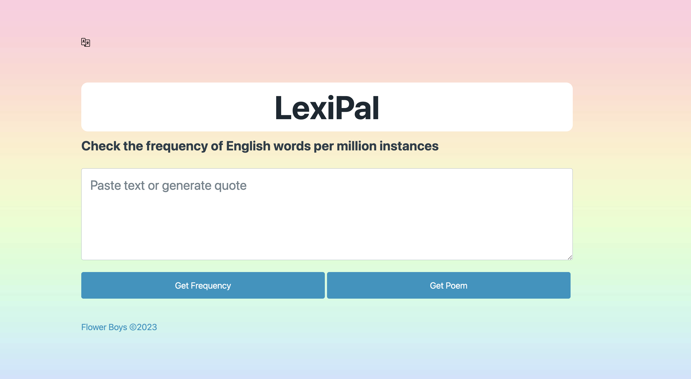
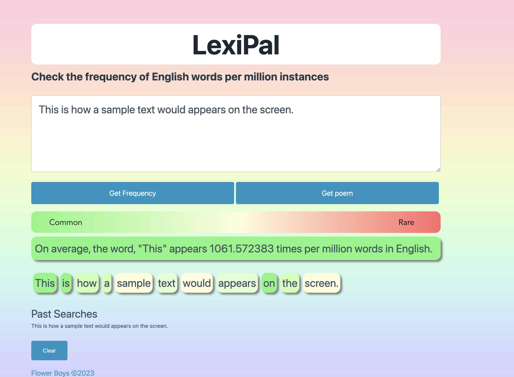

# LexiPal

A JavaScript application that allows users to easily visualize the frequency of word usage in English.

# Deployed Links :

Github Repository: https://github.com/chicago-august-20231/word-checker

Live Application Link: https://chicago-august-20231.github.io/word-checker/

# User Story :

As A user trying to learn the English Language,

I WANT to see the frequency of words in the English dictionary or see how frequently words in poems are used.

SO THAT I can see which words are used more often than others and optimize my language learning by prioritizing more common words.

# Description :

As a team, we wanted to come up with an application that makes learning the English language easier by allowing ESL learners, or any other language aficionados, to input custom text and have the frequency of each word be displayed via a simple color scheme. This allows the users to easily gauge the prevalence of each word they have inputted en masse, and allows them to optimize their language learning by prioritizing the more common words. It can also act as reassurance by informing the learner of the infrequency of words that may be more difficult to recognize or remember.

To use this application, generate random text in the form of a famous poem from the English cannon by clicking the "Get Poem" button, or input your own custom text. To see the frequency of the inputted words, click "Get Frequency". Each inputted word will then be displayed with a background color that corresponds to the frequency of its usage (green - common, red - uncommon). The user can then click a word to get more specific information about the exact frequency of use.

Users can also see their past searches, and click on them to search them again.

# Technologies Used

LexiPal is a JavaScript application that uses the Datamuse word-finding query engine to fetch the frequencies of words based on their usage per million according to the Google Books Ngrams. It also uses the PoetryDB API to generate a random 3 line poem from the English Canon. For styling, LexiPal uses a combination of Pico and custom CSS.

# Screenshot :

# Sources :

Favicon tab: https://www.flaticon.com/free-icon/data_2326855?term=dictionary&related_id=2326855

FavIcon: https://www.flaticon.com/free-icon/language_484633

Pastel rainbow picture taken from: https://www.deviantart.com/queenazraelabaddon/art/Pastel-Rainbow-Ombre-783494420

Word Frequency API: https://www.datamuse.com/api/

Poetry Quote API: https://poetrydb.org/index.html

FadeIn CSS animation (styles.css line 144) taken from: https://blog.hubspot.com/website/css-fade-in

Functions that used regex were created via the aid of this website: https://regexr.com

Thank you to the following individuals for their translation expertise:
French - Tom Maude-Griffin
Korean - 송유경
Polish - Paulina Motoszko

# License

MIT License

Copyright (c) Flower Boys - 2023 chicago-august-20231

Permission is hereby granted, free of charge, to any person obtaining a copy
of this software and associated documentation files (the "Software"), to deal
in the Software without restriction, including without limitation the rights
to use, copy, modify, merge, publish, distribute, sublicense, and/or sell
copies of the Software, and to permit persons to whom the Software is
furnished to do so, subject to the following conditions:

The above copyright notice and this permission notice shall be included in all
copies or substantial portions of the Software.

THE SOFTWARE IS PROVIDED "AS IS", WITHOUT WARRANTY OF ANY KIND, EXPRESS OR
IMPLIED, INCLUDING BUT NOT LIMITED TO THE WARRANTIES OF MERCHANTABILITY,
FITNESS FOR A PARTICULAR PURPOSE AND NONINFRINGEMENT. IN NO EVENT SHALL THE
AUTHORS OR COPYRIGHT HOLDERS BE LIABLE FOR ANY CLAIM, DAMAGES OR OTHER
LIABILITY, WHETHER IN AN ACTION OF CONTRACT, TORT OR OTHERWISE, ARISING FROM,
OUT OF OR IN CONNECTION WITH THE SOFTWARE OR THE USE OR OTHER DEALINGS IN THE
SOFTWARE.
