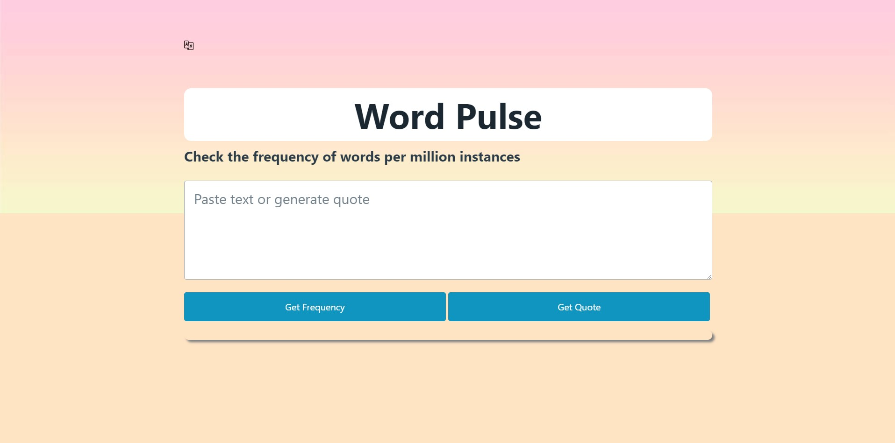

# LexiPal

# Deployed Links :

https://github.com/chicago-august-20231/word-checker

https://chicago-august-20231.github.io/word-checker/

# Description :

As a team we wanted to come up with an application that makes

learning the english language just a little bit easier for

non english speaking learners. We also wanted to color

code the returned words to show the exact frequency of the 

word and make them different colors to have more 

visual aid for the learner.

# User Story :

As A user trying to learn the english laguage

I WANT to see the frequency of words in the english dictionary or see how frequently words in poems are used.

SO THAT I can see which words are used more or less often the better help myself in language learning. 

# Screenshot :

# Sources :

language icon: https://www.flaticon.com/free-icon/language_484633
